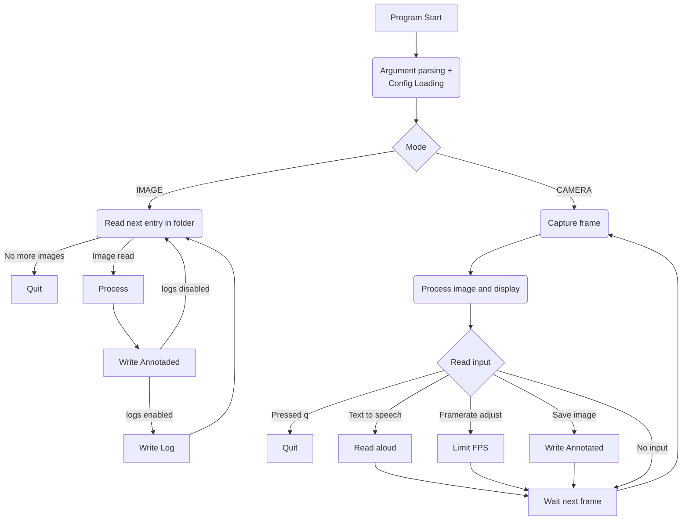

# Pattern recognizer

## Getting started

### create a new virtual env in .venv
```
python3 -m venv .venv
```

#### activate it (Linux/macOS)
```
source .venv/bin/activate
```
#### (Windows PowerShell)
```
Set-ExecutionPolicy -Scope Process -ExecutionPolicy Bypass
.\.venv\Scripts\Activate.ps1
```

#### upgrade pip and install requirements
```
python -m pip install --upgrade pip
pip install -r requirements.txt
```

### run the program
```
python src/main.py IMAGE -i assets
```


## Overview
- Detects simple geometric shapes (triangle, square, rectangle, circle) and classifies their dominant color (red, green, blue, yellow, violet).
- Two run modes:
  - `CAMERA`: Live webcam feed with a PyQt GUI, logging, save-to-disk, FPS control, and speech output via gTTS.
  - `IMAGE`: Batch-process every image in a folder, annotate detections, and log results.
- Logs detections as either an ASCII table (`pretty`) or CSV.
- Configuration is file- or CLI-driven; defaults are provided for shape and color thresholds.

### Common CLI flags
`python src/main.py [CAMERA|IMAGE] [options]`

- `--config PATH` – Optional YAML/JSON config overriding defaults (see examples below).
- `--log-dir PATH` – Destination for logs; defaults to `logs/`.
- `--log-format {pretty,csv}` – Table-style text (`pretty`, default) or CSV.

### Camera mode (PyQt GUI)
```
python src/main.py CAMERA [--config config.yaml] [--log-dir logs] [--log-format csv]
```
- Controls: Pause/Resume, FPS slider (1–30, max = unlimited), Save image (also writes current detections to log), Speak detections, press `q` to quit.
- Annotated frames are written to `camera_annotated/` when you click “Save image”.

### Image folder mode
```
python src/main.py IMAGE -i <image_dir> [-o <output_dir>] [--config config.yaml] [--log-dir logs] [--log-format csv]
```
- Processes every `.jpg/.jpeg/.png/.bmp/.tiff` in `<image_dir>`.
- Annotated copies are saved to `<image_dir>_annotated/` or to `-o <output_dir>`.
- Logs each file’s detections in the chosen format.

## Configuration
- Defaults live in `src/configs.py`; a ready-to-edit sample is `config_sample.yaml`.
- Structure (YAML):
```yaml
log_dir: logs
log_format: pretty  # or csv
shape_thresholds:
  min_area: 300
  square_aspect_tolerance: 0.15
  circularity: 0.8
  approx_epsilon: 0.04
color_thresholds:
  RED:
    - lower: [0, 70, 50]
      upper: [10, 255, 255]
    - lower: [170, 70, 50]
      upper: [180, 255, 255]
  GREEN:
    - lower: [35, 40, 40]
      upper: [85, 255, 255]
```
- Color bounds are HSV ranges; you can provide multiple segments per color (e.g., red wraps the hue axis).
- CLI flags override values from the file.

## Logging Outputs
- `pretty` → ASCII table (see `log_sample.txt`); written to `logs/detections_*.txt`.
- `csv` → header `Timestamp,Pattern,Color`; written to `logs/detections_*.csv`.
- The GUI “Save image” button also flushes current detections to the active log.

## Runtime View (high level)


## Repository Pointers
- Entry point: `src/main.py`
- Shape/color detection: `src/process.py`
- GUI: `src/gui.py`
- Logging utilities: `src/logs.py`
- Sample data: `assets/`
- Sample config and log: `config_sample.yaml`, `log_sample.txt`

## Example Workflows
- Quick demo on bundled assets: `python src/main.py IMAGE -i assets`
- Live camera with CSV logging: `python src/main.py CAMERA --log-format csv`
- Tuning thresholds via config: `python src/main.py IMAGE -i assets --config config_sample.yaml`

## Troubleshooting
- No webcam detected: confirm the device works in another app and that your OS allows access.
- GUI fails to start or Qt plugin errors: ensure PyQt5 is installed (`pip install -r requirements.txt`). Restart the venv if the `QT_QPA_PLATFORM_PLUGIN_PATH` was previously set.
- TTS silent or stuck: gTTS needs internet; check connectivity and audio output device. Temporary MP3 files are cleaned up automatically after playback.
